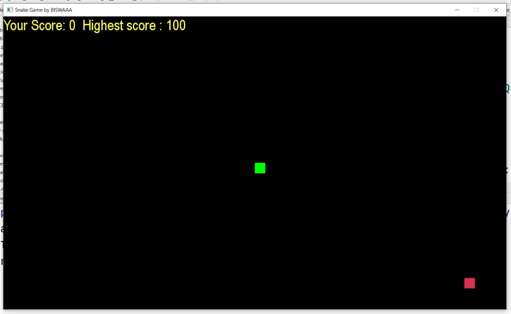
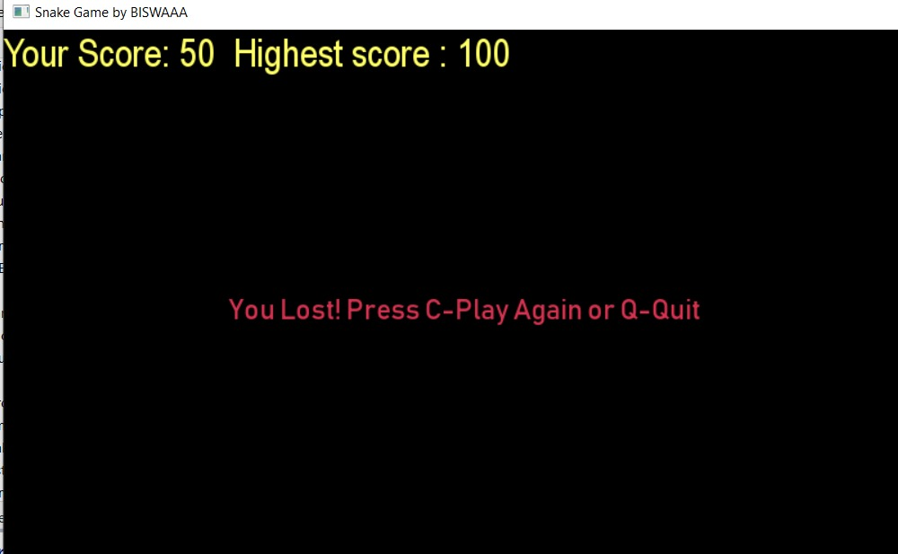
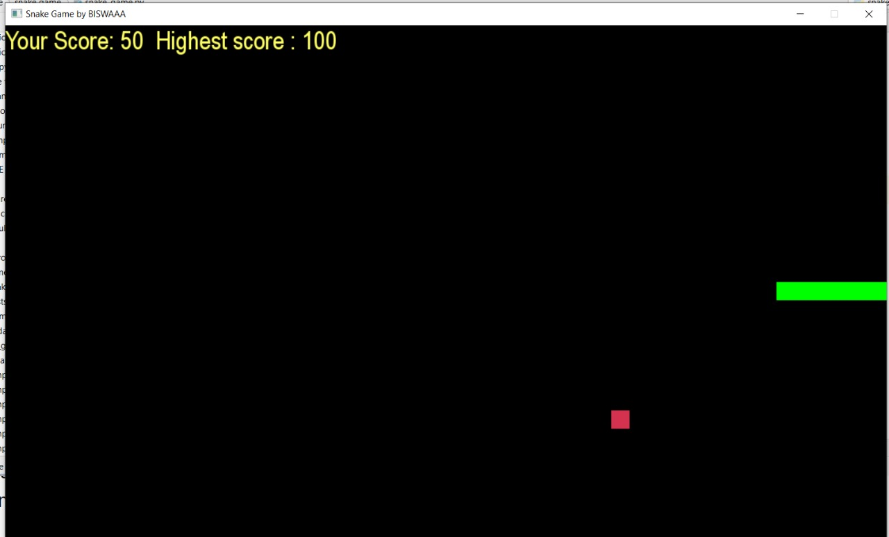
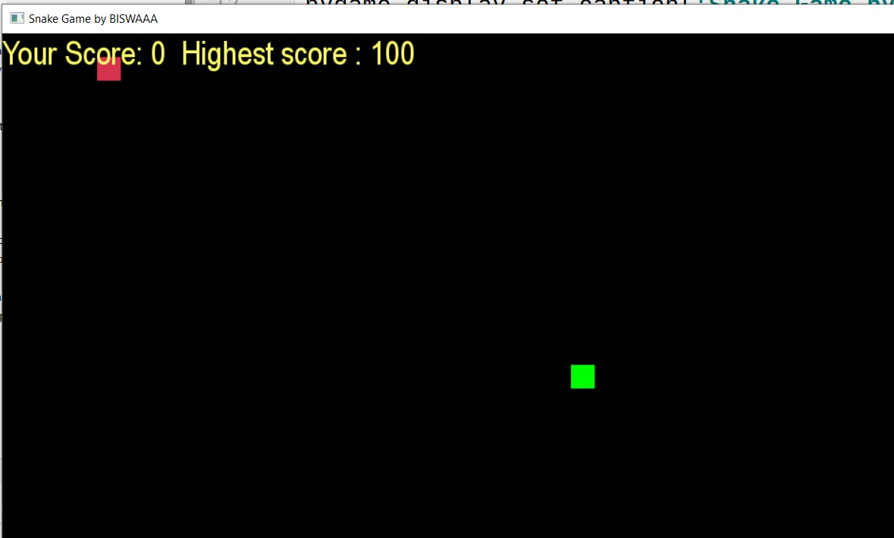

# SNAKE GAME {: .gitlab-green} :star_struck:


[](https://shields.io/) [](https://shields.io/) [](https://shields.io/) [](https://shields.io/) [](https://shields.io/)
<br>
***This new Web application is created by Biswarup Bhattacharjee, student of BTECH, in University of Engineering and Management, Kolkata.***

**Email Id: bbiswa471@gmail.com.** 

**Contact No: 916290272740.** 

[](https://www.facebook.com/biswarup.bhattacharjee.5811) [](https://github.com/biswa2210)

## About :point_down: 
{: .gitlab-orange}
It is a [snake game](https://en.wikipedia.org/wiki/Snake_(video_game_genre)) made by Python3. Here a queue of bakground music plays while playing the game. Snake game is the common name for a video game concept where the player maneuvers a line which grows in length, with the line itself being a primary obstacle. The concept originated in the 1976 arcade game Blockade, and the ease of implementing Snake has led to hundreds of versions (some of which have the word snake or worm in the title) for many platforms. After a variant was preloaded on Nokia mobile phones in 1998, there was a resurgence of interest in the snake concept as it found a larger audience. The player controls a dot, square, or object on a bordered plane. As it moves forward, it leaves a trail behind, resembling a moving snake. In some games, the end of the trail is in a fixed position, so the snake continually gets longer as it moves. In another common scheme, the snake has a specific length, so there is a moving tail a fixed number of units away from the head. The player loses when the snake runs into the screen border, a trail, other obstacle, or itself. When the game is over the high score is stored and we can see this. 
## Purpose :point_down:
<span style="color: green"> Some green text </span>
I have made this for entertainment of children as well as adults. Anyone can play it very easily. The objective of the game is to make the other player crash. The snake game is simple game. In this game the snake is eating some foods and get its size larger in step by step and getting some score.
## Importance :point_down:
{: .gitlab-orange}
A snake game is an arcade maze game which has been developed by Gremlin Industries and published by Sega in October 1976. It is considered to be a skillful game and has popularized among people for generations. The snake in the Snake game is controlled using the four direction buttons relative to the direction it is headed in. The player’s objective in the game is to achieve maximum points as possible by collecting food or fruits. The player loses once the snake hits the wall or hits itself. It is a very popular game. 
## Folder Structure :point_down:
{: .gitlab-blue}
```bash
SNAKE_GAME
    ├── sanke_game.spec
    ├── snake-game.spec
    ├── snake_game.py
    ├── highscore.txt
    ├── scorecard.txt
    └── mp3 songs
```
<details>
    <summary>
        "To read about making this project click here"
        {: .gitlab-orange}
        </summary>
    I have made this game using Python3. I have saved highscore in a file. Each time the snake eats food, its size increases. I have used some mp3 songs for background musics.
    </details>
## Screenshots :point_down: 
{: .gitlab-yellow}
<div align="center">
<a href="snake1.jpeg"></a> <a href="snake2.jpeg"></a>

<a href="snake3.jpeg"></a> <a href="snake4.jpeg"></a>
</div>
